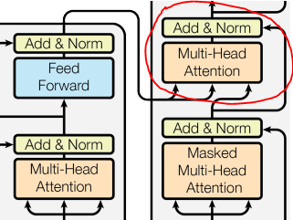
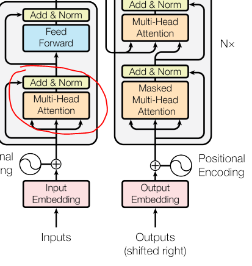

```{r setup, include=FALSE}
knitr::opts_chunk$set(echo = TRUE)
```

## Transformer arcitecture 


## Concept of attention 

The following is drawn from and article written by Stefania Cristina [@Whatisattention]. She argues that the human brain has limited memory.Therefore attention is used to determine what information is most important for the brain to store.
The article also mentions that in machine learning, attention mechanisms put more value into the most "important" parts. Our transformer model utilizes such a mechanism, and in the model attention is used in the encoders and decoders.

In the encoder/ decoder a list of vectors which each represent the elements in our text sequence is used together with an attention mechanism to highlight which parts of the input will be used to generate output.

This is then used to 

generated score values are normalized by passing them through a softmax function to generate weights that represent probabilities for each output. Encoded vectors are now scaled with the weights to generate a context vector that is then fed into decoder to generate translated output.

## Attention mechanism


First we add a class for base attention which will be used to comprise the following attention layers in the model. It consists of `tf.keras.layers.MultiHeadAttention(**kwargs)` which is a function that performs multiheaded attention.
`tf.keras.layers.LayerNormalization()` which performs normalization and
`self.add = tf.keras.layers.Add()` which adds a residual connection.

```{python ,eval = FALSE}
class BaseAttention(tf.keras.layers.Layer):
  def __init__(self, **kwargs):
    super().__init__()
    self.mha = tf.keras.layers.MultiHeadAttention(**kwargs)
    self.layernorm = tf.keras.layers.LayerNormalization()
    self.add = tf.keras.layers.Add()
```

the kwargs argument includes the parameters `query`, `key` and `value`.
Here as described in [@attentioniayn] we are "s mapping a query and a set of key-value pairs to an output" which means that the `query` which in our case is a matrix which represent searches, and combined with the `key` vectors we compare these to the attention scores and finally the process returns average across the `value` vectors weighted by attention [@tensorflow2015-whitepaper].



Now defining the cross attention layer which takes input from both the encoder and the decoder. The class uses the `self.mha` in order to perform multi-headed attention using `query,key,value` inputs. We also add residual connections from the previous layer of the decoder, and normalization. 


```{python ,eval = FALSE}
class CrossAttention(BaseAttention):
  def call(self, x, context):
    attn_output, attn_scores = self.mha(
        query=x,
        key=context,
        value=context,
        return_attention_scores=True)

    # Cache the attention scores for plotting later.
    self.last_attn_scores = attn_scores

    x = self.add([x, attn_output])
    x = self.layernorm(x)

    return x
```

Note the parameters `x` which is an argument in `self.add` and assigned as `query` while the `context` variable is the input from the encoder. the `context` variable is output from the previous `epoch`.  



We also use the base attention layer to defining a class for the global self attention layer which uses the base attention class previously defined. Here we call  `self.mha` in order to add multiheaded attention.   

```{python ,eval = FALSE}
class GlobalSelfAttention(BaseAttention):
  def call(self, x):
    attn_output = self.mha(
        query=x,
        value=x,
        key=x)
    x = self.add([x, attn_output])
    x = self.layernorm(x)
    return x
```

The difference in this layer compared to the `CrossAttention` is the input of `query`, `value` and `key` which is all encoder input.


The last attention layer we define is the `causalselfattention` layer.

```{python ,eval = FALSE}
class CausalSelfAttention(BaseAttention):
  def call(self, x):
    attn_output = self.mha(
        query=x,
        value=x,
        key=x,
        use_causal_mask = True)
    x = self.add([x, attn_output])
    x = self.layernorm(x)
    return x
```

The difference in this layer compared to the `globalselfattention` layer  is the `use_causal_mask = True` is used to "*to prevent positions from attending to subsequent positions*" which "*ensures that the predictions for position i can depend only on the known outputs at positions less than i*" [@attentioniayn].


[@TrainTransformerm]

## Attention plots 

## possible fixes

Using a larger data size might be a possible fix for the model as the data size was less than optimal.

Running the model with a more powerful computer with paralell processing might also be beneficial.

Increasing Batch sizes seem to only accelerate learning rate and result quality [@Traintips].
Dropout is supposed to be set to 0.1  [@attentioniayn]
