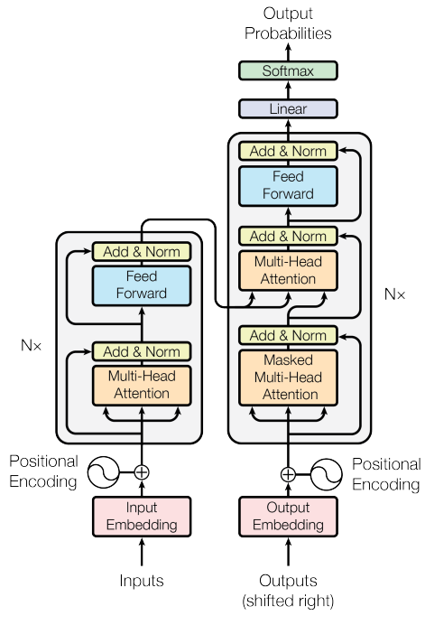
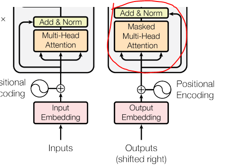

```{r setup, include=FALSE}
knitr::opts_chunk$set(echo = TRUE)
```

```{python, include=FALSE, eval= FALSE}
# Import dependencies
import pandas as pd
import numpy as np
import tensorflow


# Import training/test/validation data
train_data_folder = './data/train/'
test_data_folder = './data/test/'
val_data_folder = './data/val/'
```

# Introduction

In this project we are supposed to pick up a dataset from the internet and analyze it using appropriate deep learning techniques. The most recent advancements in deep learning have taken the world by storm. In particular, the large language model ChatGPT, almost seen to as an oracle of information, that can not only give answers to simple questions, but also generate creative and often very accurate responses to even the more demanding questions. The model used, GPT or Generative Pre-trained Transformer, uses a technique we have studied in class, the transformer architecture. With this project our goal is to dive a bit deeper into this architecture, in hopes of developing a broader understanding why it works and the difference compared to earlier techniques.


Having the transformer architecture in mind, we wanted to come up with a suitable problem and a fitting dataset. To keep the model somewhat similar to the famous chat bot, we also wanted to restrict ourselves to sequence to sequence classification, where the model input is a sequence of words (or characters) and the output is also a sequence of words. More specifically we thought it would be interesting to create a model that could summarize text. 

# Dataset

At first we wanted to use scientific papers as input to our model. However, we quickly realized that our computers restricted us to choose simpler datasets (i.e. smaller in size). We then chose a dataset containing reviews of fine foods from Amazon. The data span a period of 10 years, with a total of approximately 500,000 reviews. Reviews include product and user information, ratings, a plain text review and a summary of the review. Our intention is to use the reviews as input and the shorter review summary as output. An example drawn from the dataset is shown in figure x.x.

## Pre-Processing

This is a natural language processing problem, where it is common practice to first manipulate the text data, in order for our model to make any sense of the inputs. The main goal of pre-processing is to clean and transform the input data into a format that is fitting for a machine learning model. The first step was to remove special characters and symbols from the text. This involved removing punctuation, numbers, and other non-alphabetic characters that may not add any significant meaning to the texts. Next, we removed stop words. Stop words are essentially words that combine other words, such as "the", "a", "an", and "in" that do not add any significant meaning either. Also, we removed words with length less than three. The intuitive reasoning behind this, is according to us, mainly to reduce the dimensionality of the input data, and make the processing faster. After cleaning the text, we tokenized it. Tokenization is the process of splitting the text into individual words or subwords. This was done so that the machine learning model could process each word independently and understand the context of each word. Simply converting the lists of tokens (words or other groups of characters) into lists of numbers, where each number relates to a token.

## Positional Encoding

Positional encoding is a technique used in the Transformer architecture to incorporate the order of words in a sequence, into the model. In the "Attention is all you need" paper [@attentioniayn], the authors propose this technique. Since the Transformer model does not rely on a fixed position for words in the input sequence, it is important to provide the model with information about the relative (or absolute) positions of the words in the sequence.

The technique involves adding a vector of fixed (or learned) values to each word in the sequence to indicate its position. The positional encoding vector is calculated based on the position of the word in the sequence and the dimension of the embedding vector. Specifically, the vector contains a series of sine and cosine functions with different frequencies, which allow it to encode different positional information for each word in the sequence. The authors of the paper hypothesizes the reasoning why this method works by "it would allow the model to easily learn to attend by relative positions".

By adding positional encoding to the Transformer model, the model is able to differentiate between words based on their position in the sequence, which intuitively can improve its ability to understand the meaning of the inputs.

# Model

The model architecture used is the transformer as presented in [@attentioniayn] and the code is almost entirely copied and based of from a tutorial on tensorflow called *Neural machine translation with a Transformer and Keras* [@tensorflow2015-whitepaper] 



## Concept of attention 

The following is drawn from and article written by Stefania Cristina [@Whatisattention]. She argues that the human brain has limited memory.Therefore attention is used to determine what information is most important for the brain to store.
The article also mentions that in machine learning, attention mechanisms put more value into the most "important" parts. Our transformer model utilizes such a mechanism, and in the model attention is used in the encoders and decoders.

In the encoder/ decoder a list of vectors which each represent the elements in our text sequence is used together with an attention mechanism to highlight which parts of the input will be used to generate output.

Generated score values are normalized by passing them through a softmax function to generate weights that represent probabilities for each output. Encoded vectors are now scaled with the weights to generate a context vector that is then fed into decoder to generate translated output.

## Attention mechanism in code

First we add a class for base attention which will be used to comprise the following attention layers in the model. It consists of `tf.keras.layers.MultiHeadAttention(**kwargs)` which is a function that performs multiheaded attention.
`tf.keras.layers.LayerNormalization()` which performs normalization and
`self.add = tf.keras.layers.Add()` which adds a residual connection.

```{python ,eval = FALSE}
class BaseAttention(tf.keras.layers.Layer):
  def __init__(self, **kwargs):
    super().__init__()
    self.mha = tf.keras.layers.MultiHeadAttention(**kwargs)
    self.layernorm = tf.keras.layers.LayerNormalization()
    self.add = tf.keras.layers.Add()
```

the kwargs argument includes the parameters `query`, `key` and `value`.
Here as described in [@attentioniayn] we are "s mapping a query and a set of key-value pairs to an output" which means that the `query` which in our case is a matrix which represent searches, and combined with the `key` vectors we compare these to the attention scores and finally the process returns average across the `value` vectors weighted by attention [@tensorflow2015-whitepaper].


Now defining the cross attention layer which takes input from both the encoder and the decoder. The class uses the `self.mha` in order to perform multi-headed attention using `query,key,value` inputs. We also add residual connections from the previous layer of the decoder, and normalization. 


```{python ,eval = FALSE}
class CrossAttention(BaseAttention):
  def call(self, x, context):
    attn_output, attn_scores = self.mha(
        query=x,
        key=context,
        value=context,
        return_attention_scores=True)

    # Cache the attention scores for plotting later.
    self.last_attn_scores = attn_scores

    x = self.add([x, attn_output])
    x = self.layernorm(x)

    return x
```

Note the parameters `x` which is an argument in `self.add` and assigned as `query` while the `context` variable is the input from the encoder. the `context` variable is output from the previous `epoch`.  


We also use the base attention layer to defining a class for the global self attention layer which uses the base attention class previously defined. Here we call  `self.mha` in order to add multiheaded attention.   

```{python ,eval = FALSE}
class GlobalSelfAttention(BaseAttention):
  def call(self, x):
    attn_output = self.mha(
        query=x,
        value=x,
        key=x)
    x = self.add([x, attn_output])
    x = self.layernorm(x)
    return x
```

The difference in this layer compared to the `CrossAttention` is the input of `query`, `value` and `key` which is all encoder input.



The last attention layer we define is the `causalselfattention` layer.

```{python ,eval = FALSE}
class CausalSelfAttention(BaseAttention):
  def call(self, x):
    attn_output = self.mha(
        query=x,
        value=x,
        key=x,
        use_causal_mask = True)
    x = self.add([x, attn_output])
    x = self.layernorm(x)
    return x
```

The difference in this layer compared to the `globalselfattention` layer  is the `use_causal_mask = True` is used to "*to prevent positions from attending to subsequent positions*" which "*ensures that the predictions for position i can depend only on the known outputs at positions less than i*" [@attentioniayn].

## Feed forward network

$$
FFN(x) = \text{max}(0,xW_1 + b_1)W_2 + b_2 ~~~~(1)
$$

We define the fully connected feedforoward network as a class which will contain dense layers with a relu activation function and `dff` is the inner-layer dimensionality [@attentioniayn] `tf.keras.layers.Dense(dff, activation='relu')`

```{python, eval = FALSE}
class FeedForward(tf.keras.layers.Layer):
  def __init__(self, d_model, dff, dropout_rate=0.1):
    super().__init__()
    self.seq = tf.keras.Sequential([
      tf.keras.layers.Dense(dff, activation='relu'),
      tf.keras.layers.Dense(d_model),
      tf.keras.layers.Dropout(dropout_rate)
    ])
    self.add = tf.keras.layers.Add()
    self.layer_norm = tf.keras.layers.LayerNormalization()

  def call(self, x):
    x = self.add([x, self.seq(x)])
    x = self.layer_norm(x) 
    return x
```


Now that we have the necessary classes we define the encoder layer where we first apply GlobalSelfAttention then the FFN 

```{python, eval = FALSE}
class EncoderLayer(tf.keras.layers.Layer):
  def __init__(self,*, d_model, num_heads, dff, dropout_rate=0.1):
    super().__init__()

    self.self_attention = GlobalSelfAttention(
        num_heads=num_heads,
        key_dim=d_model,
        dropout=dropout_rate)

    self.ffn = FeedForward(d_model, dff)

  def call(self, x):
    x = self.self_attention(x)
    x = self.ffn(x)
    return x
```

`dff` is defined like previously as the FFN inner-layer dimensions , `x` in input from the previous encoder layer and `d_model` is the dimensions of the input output dimensions of the FFN , `num_heads` is the max ammount of words each text-element applies attention to and `dropout_rate` which decides how much of the outputs should be dropped. This is to prevent overfitting [@JMLR].

## decoder layer 

Now we evaluate the decoder layer which consists of `CausalSelfAttention,CrossAttention` and `feedformward` classes

```{python, eval = FALSE}
class DecoderLayer(tf.keras.layers.Layer):
  def __init__(self,
               *,
               d_model,
               num_heads,
               dff,
               dropout_rate=0.1):
    super(DecoderLayer, self).__init__()

    self.causal_self_attention = CausalSelfAttention(
        num_heads=num_heads,
        key_dim=d_model,
        dropout=dropout_rate)

    self.cross_attention = CrossAttention(
        num_heads=num_heads,
        key_dim=d_model,
        dropout=dropout_rate)

    self.ffn = FeedForward(d_model, dff)

  def call(self, x, context):
    x = self.causal_self_attention(x=x)
    x = self.cross_attention(x=x, context=context)

    # Cache the last attention scores for plotting later
    self.last_attn_scores = self.cross_attention.last_attn_scores

    x = self.ffn(x)  # Shape `(batch_size, seq_len, d_model)`.
    return x
```


## finnished transformer

Now to the final step where we add the finished transformer layer which incorporates all the previous classes 

```{python, eval = FALSE}
class Transformer(tf.keras.Model):
  def __init__(self, *, num_layers, d_model, num_heads, dff,
               input_vocab_size, target_vocab_size, dropout_rate=0.1):
    super().__init__()
    self.encoder = Encoder(num_layers=num_layers, d_model=d_model,
                           num_heads=num_heads, dff=dff,
                           vocab_size=input_vocab_size,
                           dropout_rate=dropout_rate)

    self.decoder = Decoder(num_layers=num_layers, d_model=d_model,
                           num_heads=num_heads, dff=dff,
                           vocab_size=target_vocab_size,
                           dropout_rate=dropout_rate)

    self.final_layer = tf.keras.layers.Dense(target_vocab_size)

  def call(self, inputs):
    # To use a Keras model with `.fit` you must pass all your inputs in the
    # first argument.
    context, x  = inputs

    context = self.encoder(context)  # (batch_size, context_len, d_model)

    x = self.decoder(x, context)  # (batch_size, target_len, d_model)

    # Final linear layer output.
    logits = self.final_layer(x)  # (batch_size, target_len, target_vocab_size)

    try:
      # Drop the keras mask, so it doesn't scale the losses/metrics.
      # b/250038731
      del logits._keras_mask
    except AttributeError:
      pass

    # Return the final output and the attention weights.
    return logits
```
 
Here the `self.final_layer = tf.keras.layers.Dense(target_vocab_size)` represents a final linear layer output with softmax.

Now the model is ready for training.

## result of training

Training of the model was performed with reduced data-points from 100000 to 1000 and batch size was reduced from 500 to 50. Both changes were necessary due to hardware limitations.


We see that the training of the model stopped early and thus failed.

## the lstm model

In an online article where they used the same data from amazon reviews, but instead the lstm model was used to summarize the text [@ComprehensiveGuide]. The model summary and the early stopping curve is shown as displayed on the website.


Training the data locally using the code provided in the article was however, not possible without reducing the data-size from 100000 points in the article compared to 1000 data-points when training locally. still the run-time for two epochs estimated to about 30 minutes and this was the resulting early-stopping curve when patience is set to 1.


We see that the result is early stopping at the second epoch which can be attested to the limited data size.

## comparison of lstm and transformer models

In our model for the transformer we have the same issue of the model not learning after an early epoch which we may assume is the result of the same issue with data size. We may also assume that training was done in too short of a timespan for the models to make a comparison.


#Discussion

While we were unable to train our model to a point where it actually produced useful predictions, we learnt a lot along the way. Not only did we get a sounder understanding of the transfomer architecture, but we also learnt how to implement it in code. However, if we were to recreate the project we would probably look into using a pre-trained model. This is a popular method in which you copy the weights learnt in one model on a specific task, then fine-tune it by training it on your specific dataset for a few training epochs. In an article published 2019 [@PreTrainedTransformer], the authors used a pre-trained model (BERT), modified it to text summarization, and then fine-tuned it on their dataset. Even though transformers are easier to train, due to the ability to train some parts in parallel, they are still too heavy for a student's laptop. 