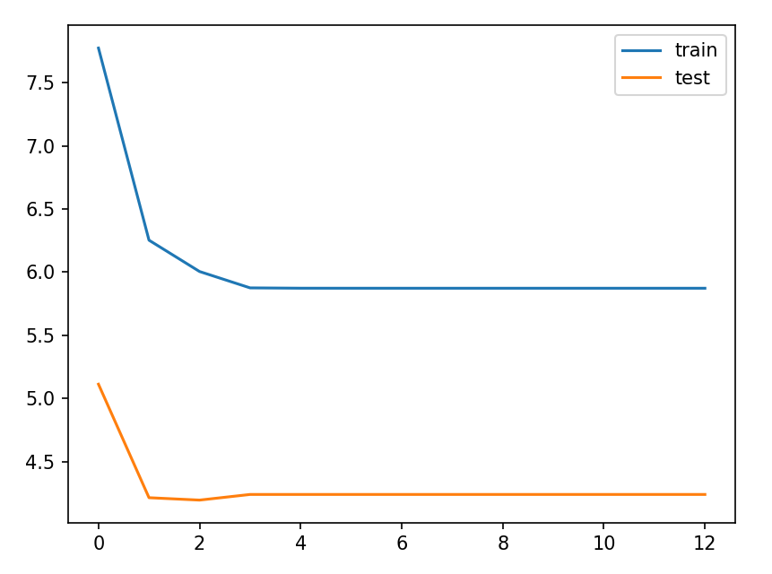

```{r setup, include=FALSE}
knitr::opts_chunk$set(echo = FALSE)
```

## Introduction
- Our goal with this project  
- Text Summarization  
- Extractive / Abstractive  

## Data
- Amazon Fine Foods
- 586 456 rows -> 10 000 rows

## Pre-Processing
Text cleaning  
- To lowercase  
- Remove special characters (non-alphanumeric)  
- Remove numbers  
- Rewrite contractions (e.g. can't = cannot)  
- Remove stop words  
- Remove words with length less than 3  

Tokenization

## Pre-Processing: Example review


## Attention
* Attention in the brain
  - used when generating memories
* Attention in code
  - using attention as weights
  - weights used to link text with output

## The transformer model


## Transformer summary


## result of training



## the lstm model trained with 100000 data points


## the lstm model trained with 1000 data points 


## comparison 
* lstm
  - 
  
## conclusion